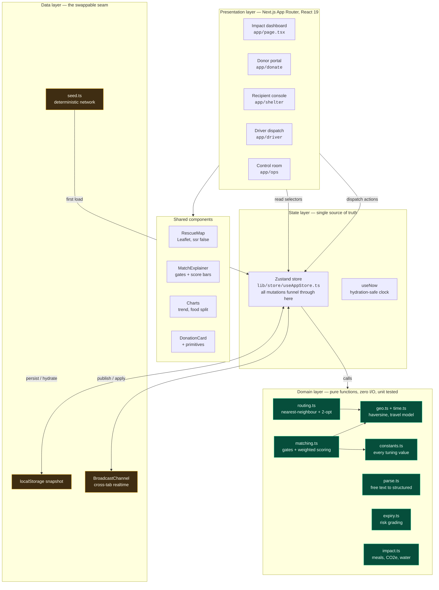
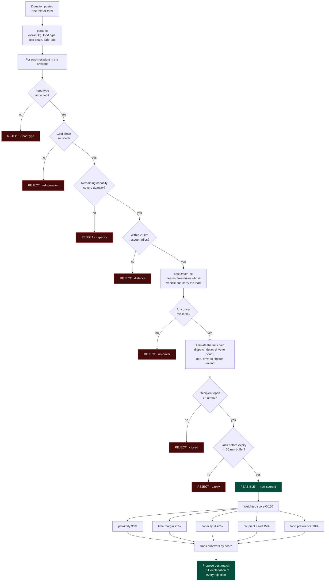
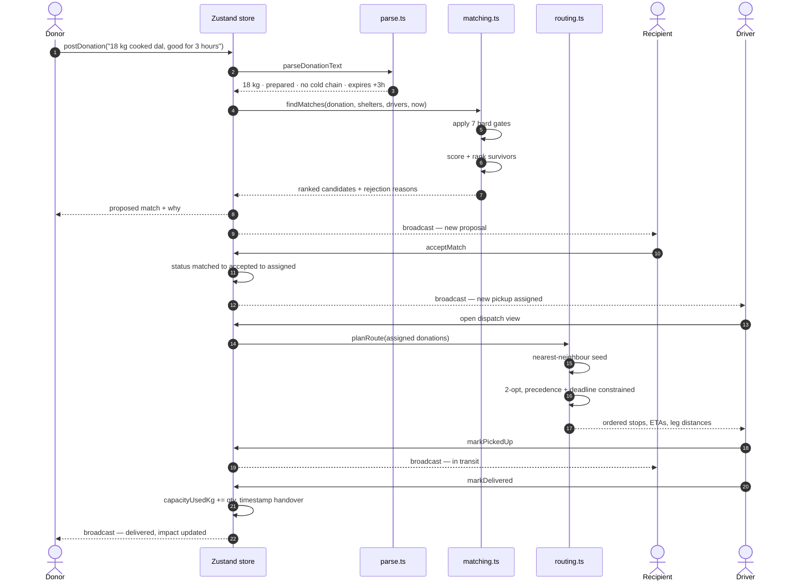
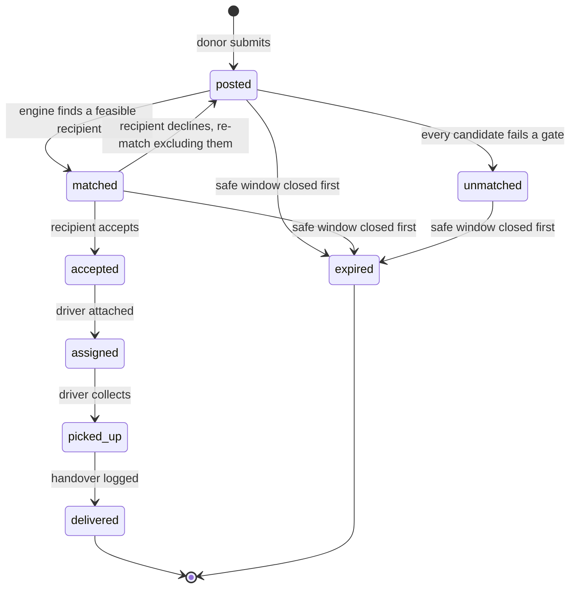
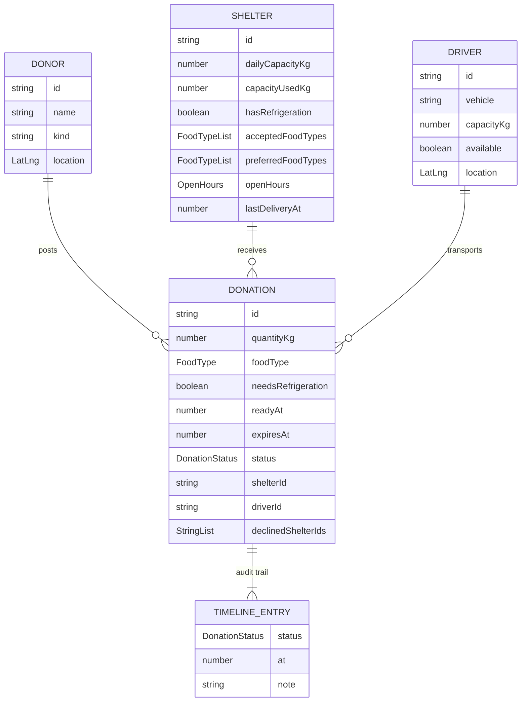
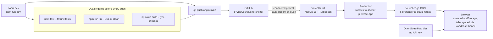

# Architecture — Surplus→Shelter

**Live demo:** [surplus-to-shelter-pi.vercel.app](https://surplus-to-shelter-pi.vercel.app) · **Repo:** [github.com/p7yush/surplus-to-shelter](https://github.com/p7yush/surplus-to-shelter)

All diagrams below are Mermaid and render directly on GitHub. A slide-ready PNG of the system diagram is at [`docs/architecture.png`](./architecture.png).

---

## 1. System architecture

The guiding constraint is that **all decision logic is pure and I/O-free.** The four role views never compute anything themselves — they read from one store, and the store calls pure domain functions. That is what makes the travel model, the persistence layer and the notification channel swappable without touching the engine.



**Green = pure and tested. Amber = the deliberate hackathon seams**, each isolated to one module. Swapping `localStorage` for Postgres or the travel model for a live routing API is a single-file change because nothing else reaches past the boundary.

---

## 2. The matching pipeline — gate before you rank

This is the core of the project. A naive implementation sorts shelters by distance; that can route dairy to a shelter with no cold storage, or food that arrives eight minutes before it expires. So **every candidate must clear seven hard gates before it is allowed to be scored at all.**



Because gates run first, **a nearer shelter can legitimately lose to a farther one** — and the control room always shows the exact reason each candidate was disqualified, so no decision is a black box.

### Travel and ETA model

Every ETA in the app flows through one function, which is why it is replaceable:

```
distance   = haversine(a, b) × 1.35          winding factor for real roads
minutes    = distance / vehicleSpeed         bike 24, car 27, van 21 km/h
arriveAt   = max(now + 6 min dispatch + driveToDonor, readyAt)
pickupAt   = arriveAt + 8 min load
deliveredAt= pickupAt + driveToShelter + 8 min unload
slack      = expiresAt − deliveredAt         must be ≥ 30 min or REJECT
```

---

## 3. Donation lifecycle



The `broadcast` arrows are real: every mutation publishes the full state over `BroadcastChannel`, so donor, recipient and driver windows update each other live without a server.

---

## 4. Donation state machine



`unmatched` and `expired` are first-class outcomes, not errors — the control room reports them, because a system that silently drops failures cannot be trusted with food safety.

---

## 5. Data model



`declinedShelterIds` exists so a decline re-runs matching while permanently excluding that recipient for that donation — without it, the engine would propose the same shelter forever.

---

## 6. Deployment



There is no backend to deploy. The whole app prerenders to static routes plus client JS, which is why cold-start latency is effectively zero — matching happens in the browser in under a millisecond, satisfying the brief's "near-instant for a good demo" constraint.

---

## 7. How the brief's constraints are met

| Constraint from the problem statement | How the architecture addresses it |
| --- | --- |
| **Safety** — never route expired-risk food | `expiry` gate rejects any candidate with under 30 min of slack after a full simulated pickup-and-delivery chain. Enforced in `matching.ts`, covered by unit tests. |
| **Reliability** — a failed match wastes the food | Failures are explicit states (`unmatched`, `expired`) surfaced in the control room with reasons, never silent. |
| **Cost / latency** — matching must be near-instant | Pure in-browser computation over the candidate set; no network round trip on the decision path. |
| **Accessibility** — usable by non-technical staff | Donors type one plain sentence; the parser does the structuring. Recipient and driver views are single-action screens. |
| **Privacy** — handle location and contact data responsibly | No personal contact data is collected; participants are organisations with approximate coordinates. No third-party analytics, and map tiles are the only external request. |
| **Scalability** — extend beyond one city | No logic is hardcoded to a city. All thresholds live in `constants.ts`; the candidate scan is the only piece that would need a geospatial index at scale, and it sits behind one function. |
| **Ethical** — don't discourage small donors | No minimum quantity, and a single-sentence post is the entire donor workload. |

---

## 8. Innovation opportunities from the brief — what was implemented

The brief lists optional advanced directions and warns that "a well-executed matching engine beats a bolted-on AI feature." Two were implemented because they genuinely serve the core problem; the rest were deliberately declined.

| Opportunity | Status |
| --- | --- |
| **NLP** — parse free-text donations into structured data | **Implemented** in `parse.ts`. Deterministic and unit-tested rather than an LLM call, so it is instant, offline and cannot hallucinate a weight. Handles kg, lb, trays, crates, sacks, loaves, litres and dozens, plus relative and absolute expiry times. |
| **Optimization** — multi-stop routing for several pickups | **Implemented** in `routing.ts`. Nearest-neighbour seed improved by 2-opt under pickup-before-dropoff precedence and expiry-deadline penalties. The gain over one-at-a-time handling is displayed in the driver view. |
| **Data analytics** — impact reporting | **Implemented** in `impact.ts`, computed from actual timestamped handovers, not estimates. |
| Computer vision food classification | Declined — adds an accuracy risk and a latency cost to the one step that already takes 20 seconds by hand. |
| Agentic AI dispatcher | Declined — the negotiation it would automate is exactly the decision that needs to stay explainable for food-safety accountability. |
| ML demand prediction | Declined — needs historical volume no pilot has on day one. |
